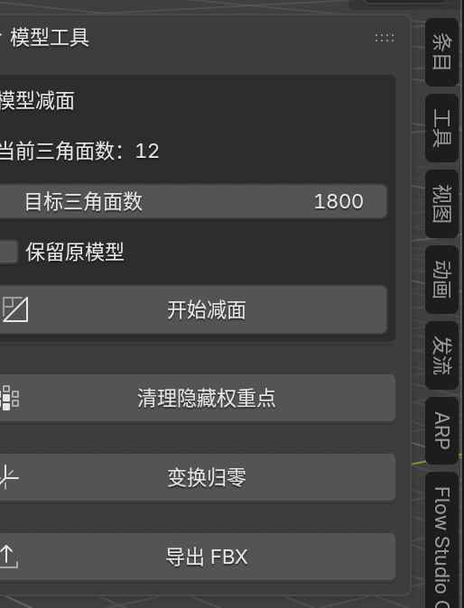

# Blender-MeshClean


> Blender 模型资产处理工具
> 针对 Blender → 游戏引擎流程中的模型权重、面数、Transform 与导出等问题，将常用的重复操作整合为一套工具。

---

## 📖 项目介绍

**Blender-MeshClean** 是一个基于 Blender Python API 开发的模型处理插件。

这个项目最初来源于实际的角色模型制作流程。

在 Blender 中制作角色动画时，一些**没有刷到骨骼权重的顶点**并不容易被发现。模型在 Blender 中进行动画测试时，这些点可能不会明显显示问题，但导入游戏引擎后，由于引擎对模型蒙皮和权重数据更加敏感，这些顶点可能出现异常显示。

如果通过人工方式处理，需要不断检查模型、寻找没有权重的顶点，再逐个进行补刷或删除，面对复杂模型时会非常浪费时间。

因此，项目首先针对这个问题制作了：

> **无权重顶点自动清理**

在此基础上，又将日常模型制作和资产交付过程中经常使用的功能逐步整合进来，包括：

* 模型减面
* 无权重顶点清理
* Transform 归零
* FBX 导出

最终形成一个用于 Blender 模型资产整理的小型工具。

---

## 💡 为什么制作这个工具？

### 从一个实际问题开始

在角色模型制作过程中，经常会遇到这样的情况：

```text
Blender 制作角色
       ↓
绑定骨骼 / 刷权重
       ↓
制作动画
       ↓
Blender 中检查
       ↓
看起来没有明显问题
       ↓
导入游戏引擎
       ↓
出现未刷权重的残留顶点
```

一些顶点在 Blender 的制作和动画过程中并不容易被发现。

但进入游戏引擎后，这些问题可能被放大，出现 Blender 中没有注意到、但引擎中能够看到的异常点。

传统处理方式需要人工检查：

```text
寻找问题顶点
      ↓
定位顶点
      ↓
检查权重
      ↓
补刷 / 删除
      ↓
重新导出
      ↓
重新进入引擎检查
```

对于复杂角色模型来说，这种方式非常耗时。

所以我首先制作了一个自动处理工具：

```text
选择模型
   ↓
自动检测无有效权重顶点
   ↓
删除无权重顶点
   ↓
重新导出
```

把原本需要人工反复检查的工作变成一个自动化操作。

### 其他功能

在解决这个问题之后，我发现模型进入引擎之前还经常需要进行一些重复操作，例如：

* 控制模型面数
* 整理 Transform
* 清理模型数据
* 导出 FBX

因此将这些制作过程中经常使用的功能逐步加入插件。

**这个项目并不是从“做一个功能很多的插件”开始，而是从实际制作中的一个问题开始，再不断将高频操作工具化。**

---

# ✨ 功能

## 01 · 模型减面

根据目标三角面数对模型进行减面处理。

插件会显示当前模型的三角面数量，并允许设置目标三角面数。

例如：

```text
当前三角面数：20,000
目标三角面数：1,800
```

设置目标面数后点击：

> **开始减面**

即可对模型进行优化。

### 功能

* 当前三角面数显示
* 自定义目标三角面数
* 一键开始减面
* 可选择保留原模型

### 使用场景

适用于：

* 游戏角色模型
* 游戏场景模型
* 实时渲染资产
* 模型交付前优化
* 高面数模型快速处理

---

## 02 · 保留原模型

减面时可以选择保留原始模型。

开启后，插件会在处理过程中保留原模型，方便进行：

```text
原始模型
    ↓
减面
    ↓
优化模型
```

可以直接进行减面前后的模型对比。

避免直接修改原始资产。

---

## 03 · 清理无权重顶点

这是插件最初制作的核心功能。

自动检测模型中**没有获得有效骨骼权重的顶点**，并将这些顶点清理掉。

### 为什么需要？

角色模型在 Blender 中制作动画时，一些没有刷到权重的点并不容易被发现。

但导入游戏引擎后，这些顶点可能因为没有正确的蒙皮权重而出现异常显示。

手动处理需要一个个寻找和检查，非常浪费时间。

插件可以将这个过程自动化：

```text
角色模型
   ↓
检测顶点权重
   ↓
找到无有效权重顶点
   ↓
自动删除
   ↓
得到干净模型
```

### 适用场景

* 角色模型
* 骨骼绑定模型
* 动画模型
* Blender → 游戏引擎
* FBX 导出前检查

---

## 04 · Transform 归零

快速整理模型的 Transform。

可以将模型的位置、旋转、缩放等变换进行统一处理。

用于解决模型在制作和导出过程中由于 Transform 不一致产生的问题。

适用于：

```text
模型制作
   ↓
整理 Transform
   ↓
变换归零
   ↓
FBX 导出
```

减少手动调整 Transform 的重复操作。

---

## 05 · FBX 导出

提供快速 FBX 导出功能。

完成模型处理后，可以直接通过插件进入 FBX 导出流程。

典型工作流：

```text
模型
 ↓
减面
 ↓
清理无权重顶点
 ↓
Transform 整理
 ↓
导出 FBX
 ↓
游戏引擎
```

---

# 🖥️ 插件界面

当前插件提供统一的「模型工具」面板。

主要操作包括：

```text
模型减面

当前三角面数
目标三角面数

保留原模型

开始减面

清理无权重顶点

变换归零

导出 FBX
```

通过将多个高频操作集中到同一个面板中，减少在 Blender 不同功能面板之间反复切换。

---

# 🚀 使用流程

### 1. 选择模型

在 Blender 中选择需要处理的模型。

### 2. 检查面数

插件自动显示当前模型的三角面数量。

### 3. 设置目标面数

输入希望得到的目标三角面数。

例如：

```text
当前：20,000 Tris
目标：1,800 Tris
```

### 4. 开始减面

点击 **「开始减面」**。

如果需要保留原模型，可以提前开启：

> 保留原模型

### 5. 清理无权重顶点

角色模型完成权重制作后，可以执行：

> **清理无权重顶点**

自动删除没有有效权重的顶点。

### 6. Transform 归零

根据资产交付需求执行：

> **变换归零**

### 7. 导出 FBX

最后点击：

> **导出 FBX**

进入后续游戏引擎或其他 3D 软件流程。

---

# 🔧 技术实现

本项目使用 **Python + Blender Python API** 开发。

### 技术栈

* Python
* Blender Python API
* Blender Mesh API
* Vertex Groups
* Object Transform
* FBX Export

### 基本处理流程

```text
Blender Scene
      │
      ▼
获取当前选中对象
      │
      ├──── 模型面数统计
      │
      ├──── 模型减面
      │
      ├──── 无权重顶点检测
      │
      ├──── Transform 处理
      │
      └──── FBX 导出
      │
      ▼
完成模型资产整理
```

---

# 🎯 项目价值

这个项目的核心并不是增加 Blender 中原本不存在的功能，而是：

> **把实际 3D 制作流程中高频、重复、容易出错的操作进行自动化。**

尤其是无权重顶点清理功能，它解决的是：

**Blender 中不容易发现 → 游戏引擎中暴露 → 人工排查耗时**

这一实际生产问题。

通过工具化，可以将：

```text
人工检查
+
人工定位
+
人工处理
```

转换为：

```text
一键检测
+
自动处理
```

从而减少模型进入引擎后的反复检查成本。

---

# 📦 安装

下载项目中的：

```text
model_tools_addon.zip
```

打开 Blender：

```text
Edit
  ↓
Preferences
  ↓
Add-ons
  ↓
Install...
```

选择：

```text
model_tools_addon.zip
```

安装后勾选插件即可。

---

# 📁 项目结构

```text
Blender-MeshClean/
│
├── README.md
│
├── model_tools_addon.py
│
└── model_tools_addon.zip
```

---

# 🗺️ Roadmap

### 已完成

* [x] 模型三角面数统计
* [x] 目标三角面数设置
* [x] 模型减面
* [x] 保留原模型
* [x] 无权重顶点清理
* [x] Transform 归零
* [x] FBX 导出


---

# 📷 Preview

插件界面：



# 📌 Project Status

**🚧 开发中**

Blender-MeshClean 是一个持续迭代的 Blender 模型资产处理工具。

项目会继续围绕实际 3D 制作流程，逐步加入更多模型优化、资产检查和自动化处理功能。

---

## License

本项目目前主要用于个人学习、3D 制作流程优化以及工具开发实践。
